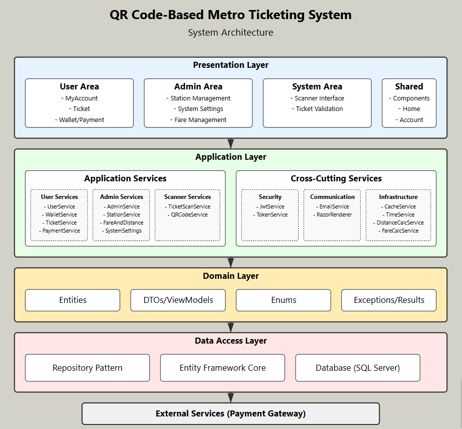
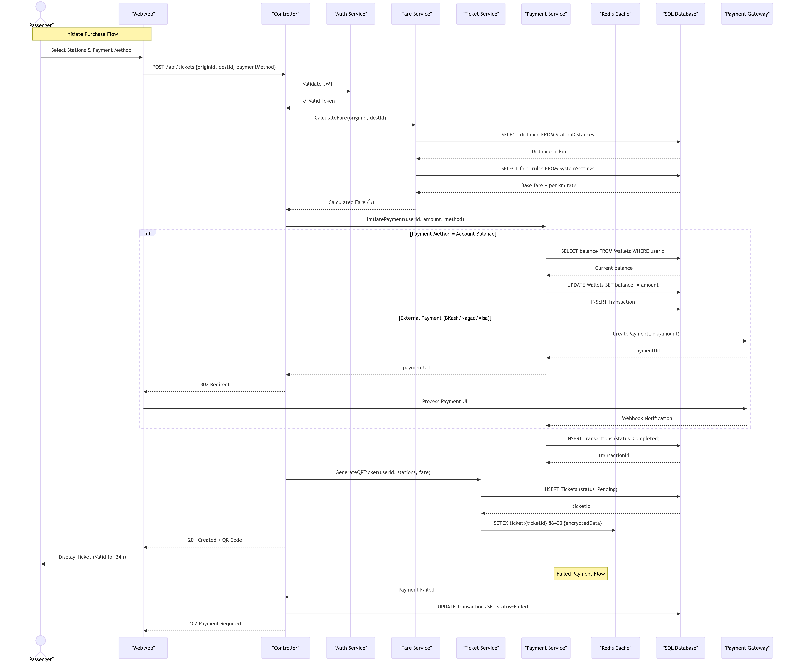

# 📄 Architecture
## 1. High-Level System Architecture Diagram

The system is designed following a clean layered architecture, separating concerns between UI, business logic, and data management.
It ensures scalability, maintainability, and high performance for metro ticket operations. 

## 2. Component Descriptions
|Layer | Description|
|-----------------|-------------------------------------------------------|
|Presentation Layer | ASP.NET MVC application for the user and admin interfaces. Handles all user interactions.|
|Application Layer | Contains services, controllers, and managers. Implements business logic such as QR code generation, ticket validation, and fare calculation.|
|Infrastructure Layer | Manages external resources including SQL Server database, Redis caching, and third-party services (e.g., email notifications).|
|Core Layer | Defines the domain models, repository interfaces, and shared utilities. Core remains independent of other layers to maintain clean architecture principles.|
 
## 3. Data Flow Explanation

  **Ticket Purchase Process:**
  
  - User selects desired metro journey and requests ticket.
  
  - Backend generates a secure QR code.
  
  - QR ticket metadata is stored in Redis for fast retrieval.
  
  - A copy is persisted into SQL Server for durability.
  
  **Ticket Validation at Entry/Exit Gates:**
  
  - Passenger scans the QR code at entry.
  
  - Gate controller queries the system:
  
  - First, Redis is checked for validity.
  
  - If not found (cache miss), fallback to SQL Server.
  
  - Entry or exit time is recorded.
  
  - After exit, fare is calculated and stored.
  
  - QR code is marked as used to prevent replay attacks.

## 4. Failover and Recovery Strategy

 - **Redis** is used as the primary real-time cache for QR code validation to provide **low latency**.
  
 - **SQL Server** is the system of record (persistent storage) in case of Redis failure.
  
 - If Redis cache is unavailable:
  
    - System will query SQL Server to validate tickets.
  
     - After successful validation, Redis cache will be refreshed (lazy loading).
  
  - **Automatic Retry:**
  
      - On transient errors (e.g., temporary database disconnection), the system retries a few times before giving a final error.
  
  - **Security Measures:**
  
     - JWT-based authentication protects API endpoints.
      
     - QR codes expire after one-time use to prevent unauthorized re-entry.
