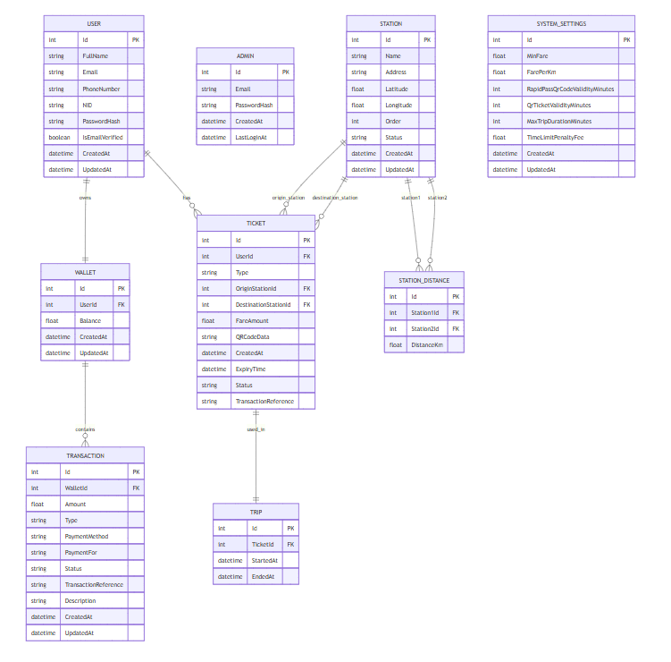

# 📄 Database Schema

## Overview
This document describes the database schema for the QR Code Based Metro Ticketing System, including the ER diagram, detailed table descriptions, and indexes & constraints.

## 📈 ER Diagram

## 🧩Database Table Descriptions

### 1. Admin

| Column       | Type            | Constraints               | Description             |
|--------------|------------------|---------------------------|-------------------------|
| Id           | int              | PK, Identity              | Primary key             |
| Email        | nvarchar(255)    | Required, Unique          | Admin email address     |
| PasswordHash | nvarchar(255)    | Required                  | Hashed password         |
| CreatedAt    | datetime         | Default: UTC Now          | Account creation timestamp |
| LastLoginAt  | datetime         | Nullable                  | Last login timestamp    |

### 2. Station

| Column     | Type            | Constraints         | Description                |
|------------|------------------|---------------------|----------------------------|
| Id         | int              | PK, Identity        | Primary key                |
| Name       | nvarchar(100)    | Required, Unique    | Station name               |
| Address    | nvarchar(255)    | Required            | Station address            |
| Latitude   | decimal(12,8)    | Required            | GPS latitude               |
| Longitude  | decimal(12,8)    | Required            | GPS longitude              |
| Order      | int              | Required            | Order of station in route |
| Status     | nvarchar(50)     | Required            | Active/Inactive            |
| CreatedAt  | datetime         | Default: UTC Now    | Creation time              |
| UpdatedAt  | datetime         | Default: UTC Now    | Update time                |

### 3. StationDistance

| Column        | Type           | Constraints            | Description                  |
|---------------|----------------|------------------------|------------------------------|
| Id            | int            | PK, Identity           | Primary key                  |
| Station1Id    | int            | FK → Station(Id)       | First station reference      |
| Station2Id    | int            | FK → Station(Id)       | Second station reference     |
| Distance      | decimal(12,6)  | Required               | Distance between stations    |
| CreatedAt     | datetime       | Default: UTC Now       | Creation time                |
| UpdatedAt     | datetime       | Default: UTC Now       | Update time                  |

### 4. SystemSettings

| Column                     | Type        | Constraints   | Description                           |
|----------------------------|-------------|---------------|---------------------------------------|
| Id                         | int         | PK, Identity  | Primary key                           |
| MinFare                    | decimal     | >= 0          | Minimum base fare                     |
| FarePerKm                 | decimal     | >= 0          | Fare per kilometer                    |
| RapidPassQrCodeValidityMinutes | int    | >= 1          | RapidPass QR validity in minutes      |
| QrTicketValidityMinutes    | int         | >= 1          | QR Ticket validity in minutes         |
| MaxTripDurationMinutes     | int         | >= 1          | Max trip duration allowed             |
| TimeLimitPenaltyFee        | decimal     | >= 0          | Penalty for time overstay             |
| CreatedAt                  | datetime    | Default: Now  | Creation timestamp                    |
| UpdatedAt                  | datetime    | Default: Now  | Update timestamp                      |

### 5. Ticket

| Column               | Type                 | Constraints                      | Description                         |
|----------------------|----------------------|----------------------------------|-------------------------------------|
| Id                   | int                  | PK, Identity                     | Primary key                         |
| UserId               | int                  | FK → User(Id)                    | Ticket owner                        |
| Type                 | enum (TicketType)    | Required                         | QR Ticket or RapidPass              |
| OriginStationId      | int                  | FK → Station(Id), Nullable      | Start station for QR Ticket         |
| DestinationStationId | int                  | FK → Station(Id), Nullable      | End station for QR Ticket           |
| FareAmount           | decimal(18,2)        | Nullable                         | Calculated fare                     |
| QRCodeData           | nvarchar(max)        | Required                         | Encrypted QR Code content           |
| CreatedAt            | datetime             | Default: UTC Now                 | Creation timestamp                  |
| ExpiryTime           | datetime             | Required                         | Expiry timestamp                    |
| Status               | enum (TicketStatus)  | Default: Active                  | Ticket lifecycle status             |
| TransactionReference | nvarchar(50)         | Nullable                         | Linked transaction ID (if any)      |

### 6. Transaction

| Column               | Type                     | Constraints               | Description                          |
|----------------------|--------------------------|---------------------------|--------------------------------------|
| Id                   | int                      | PK, Identity              | Primary key                          |
| WalletId             | int                      | FK → Wallet(Id)           | Wallet where transaction happened    |
| Amount               | decimal(18,2)            | Required                  | Amount transferred                   |
| Type                 | enum (TransactionType)   | Required                  | Transaction type                     |
| PaymentMethod        | enum (PaymentMethod)     | Required                  | Payment method used                  |
| PaymentFor           | enum (PaymentItem)       | Nullable                  | Related service                      |
| Status               | enum (TransactionStatus) | Required                  | Status (Pending, Completed etc)      |
| TransactionReference | nvarchar(50)             | Nullable                  | External transaction id              |
| Description          | nvarchar(255)            | Nullable                  | Optional description                 |
| CreatedAt            | datetime                 | Default: UTC Now          | Creation timestamp                   |
| UpdatedAt            | datetime                 | Default: UTC Now          | Update timestamp                     |

### 7. Trip

| Column               | Type                 | Constraints              | Description                        |
|----------------------|----------------------|--------------------------|------------------------------------|
| Id                   | int                  | PK, Identity             | Primary key                        |
| UserId               | int                  | FK → User(Id)            | Passenger                          |
| TicketId             | int                  | FK → Ticket(Id)          | Ticket used                        |
| EntryStationId       | int                  | FK → Station(Id)         | Boarding station                   |
| ExitStationId        | int                  | FK → Station(Id), Nullable | Exit station (if trip ended)    |
| EntryTime            | datetime             | Default: UTC Now         | Entry time                         |
| ExitTime             | datetime             | Nullable                 | Exit time                          |
| FareAmount           | decimal(18,2)        | Nullable                 | Fare to deduct                     |
| Status               | enum (TripStatus)    | Default: InProgress      | Trip status                        |
| TransactionReference | nvarchar(50)         | Nullable                 | Linked transaction reference       |

### 8. User

| Column         | Type              | Constraints           | Description              |
|----------------|-------------------|------------------------|--------------------------|
| Id             | int               | PK, Identity           | Primary key              |
| FullName       | nvarchar(100)     | Required               | Full name                |
| Email          | nvarchar(255)     | Required, Unique       | Email address            |
| PhoneNumber    | nvarchar(15)      | Required, Unique       | Phone number             |
| NID            | nvarchar(30)      | Required, Unique       | National ID number       |
| PasswordHash   | nvarchar(max)     | Required               | Hashed password          |
| IsEmailVerified| bool              | Default: False         | Email verification status|
| CreatedAt      | datetime          | Default: UTC Now       | Creation timestamp       |
| UpdatedAt      | datetime          | Default: UTC Now       | Update timestamp         |

### 9. UserToken

| Column      | Type                | Constraints               | Description                              |
|-------------|---------------------|----------------------------|------------------------------------------|
| Id          | int                 | PK, Identity               | Primary key                              |
| Email       | nvarchar(255)       | Required                   | Email address                            |
| Token       | nvarchar(max)       | Required                   | Verification/reset token                 |
| Type        | enum (TokenType)    | Required                   | Token type (EmailVerification/PasswordReset) |
| ExpiryDate  | datetime            | Required                   | Expiration time                          |
| IsUsed      | bool                | Default: False             | Whether already used                     |

### 10. Wallet

| Column     | Type             | Constraints        | Description                  |
|------------|------------------|--------------------|------------------------------|
| Id         | int              | PK, Identity       | Primary key                  |
| UserId     | int              | FK → User(Id)      | Linked user                  |
| Balance    | decimal(18,2)    | Default: 0         | Current wallet balance       |
| CreatedAt  | datetime         | Default: UTC Now   | Creation timestamp           |
| UpdatedAt  | datetime         | Default: UTC Now   | Update timestamp             |

## 🛡️ Indexes & Constraints
**Primary Keys:**
 - Id column in every table.

**Foreign Keys:**

 - StationDistance.Station1Id, StationDistance.Station2Id → Station.Id
 - Ticket.UserId → User.Id
 - Ticket.OriginStationId → Station.Id
 - Ticket.DestinationStationId → Station.Id
 - Transaction.WalletId → Wallet.Id
 - Trip.UserId → User.Id
 - Trip.TicketId → Ticket.Id
 - Trip.EntryStationId → Station.Id
 - Trip.ExitStationId → Station.Id
 - Wallet.UserId → User.Id

**Unique Constraints:**
 - Admin.Email
 - User.Email
 - User.PhoneNumber
 - User.NID

## ✅ Summary
 - Normalized database design (no redundancy).
 - Optimized for high read/write performance (Redis fallback).
 - Indexes boost critical operations (QR code lookup, login).
 - Secure architecture with encryption and authentication.

