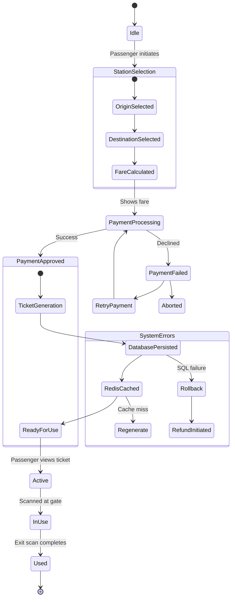
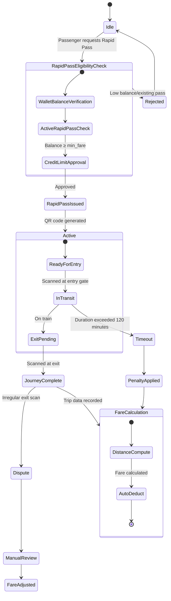

## 🎟️ State Diagram For Ticket

### Purchasing QR Ticket

```mermaid
stateDiagram-v2
    [*] --> Idle
    Idle --> StationSelection: Passenger initiates
    
    state StationSelection {
        [*] --> OriginSelected
        OriginSelected --> DestinationSelected
        DestinationSelected --> FareCalculated
    }
    
    FareCalculated --> PaymentProcessing: Shows fare
    PaymentProcessing --> PaymentApproved: Success
    PaymentProcessing --> PaymentFailed: Declined
    
    state PaymentApproved {
        [*] --> TicketGeneration
        TicketGeneration --> DatabasePersisted
        DatabasePersisted --> RedisCached
        RedisCached --> ReadyForUse
    }
    ReadyForUse --> Active: Passenger views ticket
    Active --> InUse: Scanned at gate
    InUse --> Used: Exit scan completes
    Used --> [*]

    %% Error Handling
    PaymentFailed --> RetryPayment
    RetryPayment --> PaymentProcessing
    PaymentFailed --> Aborted
    
    state SystemErrors {
        DatabasePersisted --> Rollback: SQL failure
        RedisCached --> Regenerate: Cache miss
        Rollback --> RefundInitiated
    }
```
### Rapid Pass QR Ticket

```mermaid
stateDiagram-v2
    [*] --> Idle

    Idle --> RapidPassEligibilityCheck: Passenger requests Rapid Pass
    
    state RapidPassEligibilityCheck {
        [*] --> WalletBalanceVerification
        WalletBalanceVerification --> ActiveRapidPassCheck
        ActiveRapidPassCheck --> CreditLimitApproval: Balance ≥ min_fare
    }
    
    CreditLimitApproval --> RapidPassIssued: Approved
    RapidPassIssued --> Active: QR code generated
    
    state Active {
        [*] --> ReadyForEntry
        ReadyForEntry --> InTransit: Scanned at entry gate
        InTransit --> ExitPending: On train
    }
    
    ExitPending --> JourneyComplete: Scanned at exit
    JourneyComplete --> FareCalculation: Trip data recorded
    
    state FareCalculation {
        [*] --> DistanceCompute
        DistanceCompute --> AutoDeduct: Fare calculated
        AutoDeduct --> [*]
    }
    
    %% Error/Alternative Flows
    RapidPassEligibilityCheck --> Rejected: Low balance/existing pass
    Rejected --> Idle
    
    InTransit --> Timeout: Duration exceeded 120 minutes
    Timeout --> PenaltyApplied
    PenaltyApplied --> FareCalculation
    
    JourneyComplete --> Dispute: Irregular exit scan
    Dispute --> ManualReview
    ManualReview --> FareAdjusted
```
---
