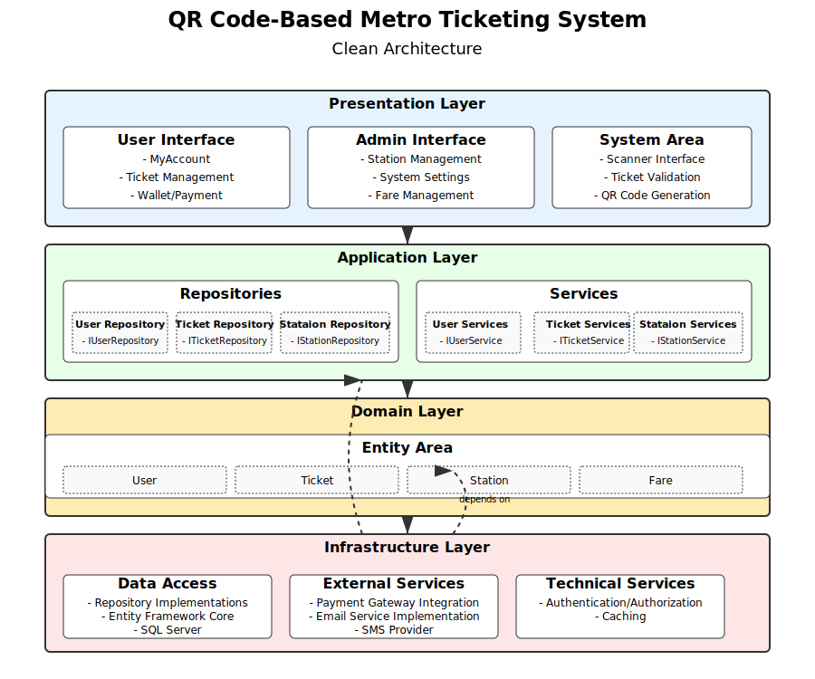

# System Architecture

## 1. System Overview
The QR Code Metro Ticketing System is built to provide fast and secure metro entry/exit using QR codes, leveraging .NET 8, Redis, and SQL Server.

## 2. High-Level Architecture
- User Interface: ASP.NET MVC application.
- Backend API: ASP.NET Core services.
- Database: SQL Server 2022 for storing user, station, and ticket information.
- Caching Layer: Redis for fast QR validation and session storage.

## 3. Component Descriptions
- **Frontend (MVC App):** Provides user interfaces for ticket generation, validation, and administration.
- **Backend (Services):** Handles business logic, authentication, QR code management, and database operations.
- **SQL Server:** Stores persistent data such as users, stations, trips, and transaction history.
- **Redis:** Temporarily stores active QR codes and session tokens for fast retrieval.

## 4. Data Flow
1. User requests a QR ticket from the frontend.
2. Frontend calls backend services to generate QR.
3. Backend saves data in SQL Server and stores QR token in Redis.
4. On metro entry/exit, QR is scanned, validated via Redis, and updates database if valid.

