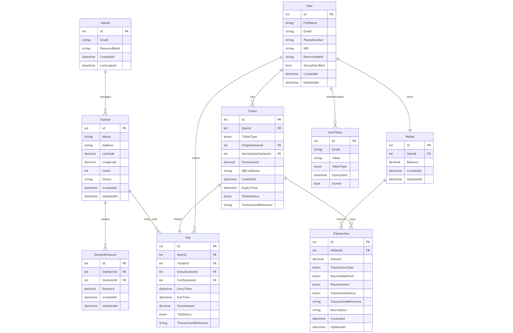

#  ⚙️System Design

The QR Code Metro Ticketing System is built to provide fast and secure metro entry/exit using QR codes, leveraging .NET 8, Redis, and SQL Server.

## 🎨System Architecture

## 📈 ER Diagram

### 🧩Database Table Descriptions

| Table           | Description                                                                                     |
|----------------|-------------------------------------------------------------------------------------------------|
| Users          | Stores passenger information including authentication and profile data        |
| Admins         | Stores admin credentials and access logs.                                              |
| Stations       | Stores metro station information like name, address, coordinates, and display order.             |
| StationDistances | Stores distance data between two stations for fare calculation.                               |
| Tickets        | Stores ticket details including journey info, fare, QR code metadata, and ticket status.         |
| Trips          | Stores trip records including entry/exit stations, timings, fare, and trip status.               |
| Wallets        | Stores user wallet balances for fare payment and ticket purchases.                               |
| Transactions   | Stores wallet transaction records like top-ups, fare deductions, and penalties.                  |
| SystemSettings | Stores system-wide settings like fare rates, ticket validity, and penalty fees.                  |

### 🛡️ Indexes & Constraints
 **Primary Keys:**
  - Id column in every table.
 
 **Foreign Keys:**
 
  - StationDistance.Station1Id, StationDistance.Station2Id → Station.Id
  - Ticket.UserId → User.Id
  - Ticket.OriginStationId → Station.Id
  - Ticket.DestinationStationId → Station.Id
  - Transaction.WalletId → Wallet.Id
  - Trip.UserId → User.Id
  - Trip.TicketId → Ticket.Id
  - Trip.EntryStationId → Station.Id
  - Trip.ExitStationId → Station.Id
  - Wallet.UserId → User.Id
 
 **Unique Constraints:**
  - Admin.Email
  - User.Email
  - User.PhoneNumber
  - User.NID

## 🎟️ Ticket Purchase Flow

---
