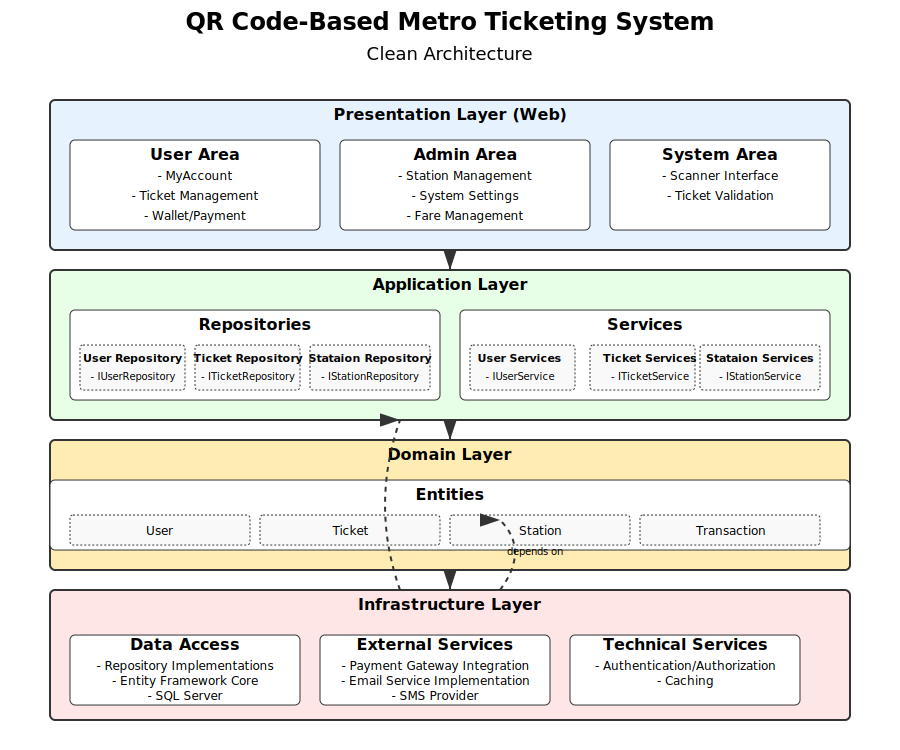
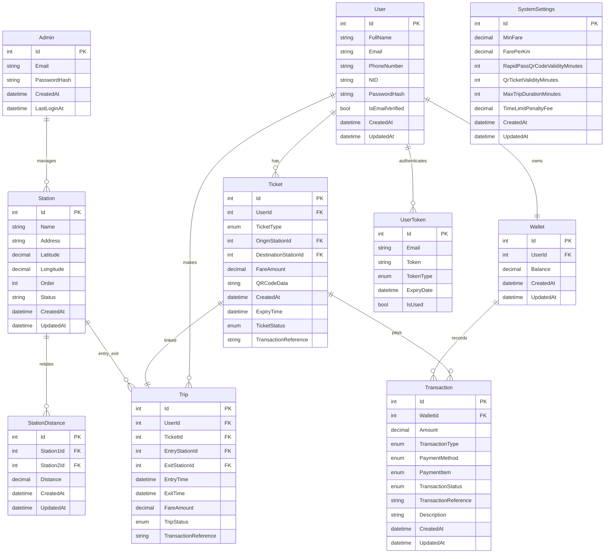
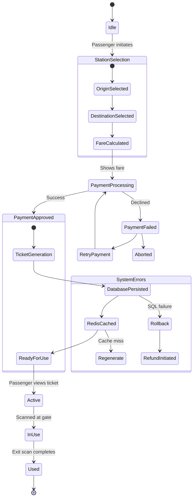
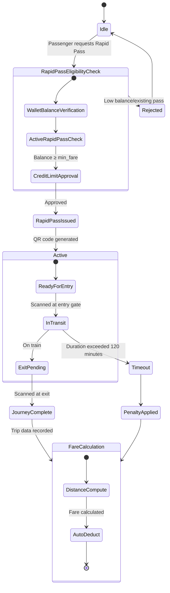

#  ⚙️System Design

The QR Code Based Metro Ticketing System is built to provide fast and secure metro entry/exit using QR codes, leveraging .NET 8, Redis, and SQL Server.

## 🎨System Architecture

## 📈 ER Diagram

### 🧩Database Table Descriptions

| Table           | Description                                                                                     |
|----------------|-------------------------------------------------------------------------------------------------|
| Users          | Stores passenger information including authentication and profile data        |
| Admins         | Stores admin credentials and access logs.                                              |
| Stations       | Stores metro station information like name, address, coordinates, and display order.             |
| StationDistances | Stores distance data between two stations for fare calculation.                               |
| Tickets        | Stores ticket details including journey info, fare, QR code metadata, and ticket status.         |
| Trips          | Stores trip records including entry/exit stations, timings, fare, and trip status.               |
| Wallets        | Stores user wallet balances for fare payment and ticket purchases.                               |
| Transactions   | Stores wallet transaction records like top-ups, fare deductions, and penalties.                  |
| SystemSettings | Stores system-wide settings like fare rates, ticket validity, and penalty fees.                  |

## 🎟️ State Diagram For Ticket

### 1. Purchasing QR Ticket

### 2. Rapid Pass QR Ticket

---
